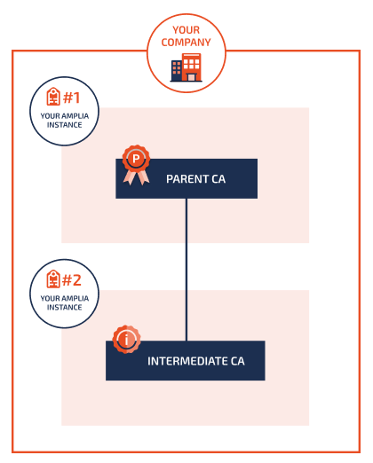
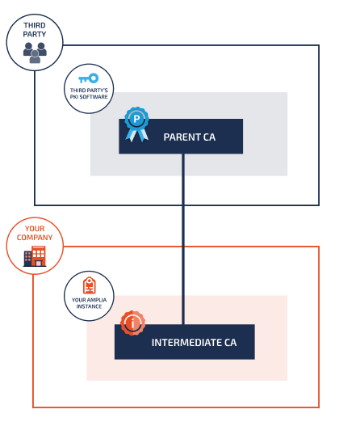
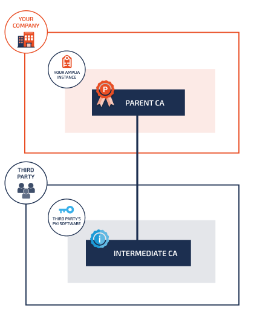

# Create an intermediate CA - Amplia

To create an **intermediate certification authority** on [Amplia](../index.md), choose the scenario which best describes your case:

* If you control both the parent and intermediate CA ...
  * ... and they are hosted on the same Amplia instance, see the [Centralized scenario](#centralized)
  * ... and they are hosted on separate Amplia instances, see the [Distributed scenario](#distributed)
* If you either only control the intermediate or the parent CA, see [Other scenarios](#other)

> [!NOTE]
> *Parent CA* is the CA under which the intermediate CA will be created. Unless your case involves multiple levels of
> intermediate CAs, this simply means the root CA.

<a name="centralized" />

## Centralized scenario

You may host your intermediate CA on the same Amplia instance as the parent CA:

In this case, follow the steps below.

### 1. Create the CA key

On the left menu, click on **Keys**, then on **Generate** and fill out:

* **Name**: `ca` or a name of your preference (`kebab-case` is recommended for naming keys)
* **Key Store**: select a key store to store the CA key on. If unsure, choose **Database**
* **Key Type**: typically `RSA`
* **Size**: typically 4096

Click on **Create**.

### 2. Issue the CA certificate

On the left menu, click on **CA Certificates**, then on **Issue CA Certificate** and fill out:

* **Issuer**: select the parent CA (generally your root CA)
* Leave **Internal key** selected
* **Key**: select the key you just generated

Fill out the remaining fields according to your case and click **Issue**.

### 3. Create the CA

On the left menu, click on **CAs**, then on **Create CA** and fill out:

* **Key**: select the key you just generated
* **Name**: the form will suggest using the same name as the key, don't change the suggested value unless you have a good reason
* Leave **Public Key CA** selected
* Leave **Internal Certificate** selected
* **Certificate**: select the certificate you just issued

Click on **Create**.

After the CA is created, click on **Activate**, then **Yes**.

<a name="distributed" />

## Distributed scenario

You may also host your intermediate CA while having the parent CA hosted on a different Amplia instance:

In this case, follow the steps below.

<a name="distributed-create-key" />

### 1. Create the CA key and generate a CSR (intermediate CA instance)

On the intermediate CA instance, on the left menu, click on **Keys**, then on **Generate** and fill out:

* **Name**: `ca` or a name of your preference (`kebab-case` is recommended for naming keys)
* **Key Store**: select a key store to store the CA key on. If unsure, choose **Database**
* **Key Type**: typically `RSA`
* **Size**: typically 4096

Click on **Create**.

On the key details page, click on **Show CSR** and copy the CSR contents to your clipboard.

<a name="distributed-issue-ca-cert" />

### 2. Issue the CA certificate (parent CA instance)

On the parent CA instance, on the left menu, click on **CA Certificates**, then on **Issue CA Certificate** and fill out:

* **Issuer**: select the parent CA (generally your root CA)
* Select **External Key**
* **CSR**: paste the CSR of the intermediate CA key

Fill out the remaining fields according to your case and click **Issue**, then click **Download** and save the CA certificate file.

<a name="distributed-create-ca" />

### 3. Create the CA (intermediate CA instance)

Back on the intermediate CA instance, on the left menu, click on **CAs**, then on **Create CA** and fill out:

* **Key**: select the key you just generated
* **Name**: the form will suggest using the same name as the key, don't change the suggested value unless you have a good reason
* Leave **Public Key CA** selected
* Select **External Certificate**
* Upload the CA certificate file you just downloaded

Click on **Create**.

After the CA is created, click on **Activate**, then **Yes**.

<a name="other" />

## Other scenarios

There are also scenarios in which you either control only the intermediate CA or the parent CA, while the other CA is controlled by some third party. In such cases,
the procedure is similar to the [distributed scenario](#distributed), with the difference that some steps are performed by the third party.

### Intermediate CA under a third party's parent CA

In this scenario, you control only the intermediate CA but not the parent CA, for instance if you are creating an intermediate CA under a country's root CA:

In this case, steps 1 and 3 are your responsibility, while step 2 is performed by the third party:

1. [Create the CA key and generate a CSR](#distributed-create-key) and send the CSR to the third party
1. The third party is then responsible for issuing the CA certificate with your CSR and handing you the CA certificate file
1. With the CA certificate file, [create the CA](#distributed-create-ca)

### Third party intermediate CA under your parent CA

In this scenario, you control only the parent CA but not the intermediate CA, that is, a third party is creating an intermediate CA under your own CA hosted on
Amplia, for instance if you use Amplia to host a country's root CA:

Then only step 2 is your responsibility, while steps 1 and 3 are performed by the third party:

1. The third party is responsible for generating the CA key and the corresponding CSR
1. You then [issue the CA certificate](#distributed-issue-ca-cert) with the given CSR and send the CA certificate file back to the third party
1. The third party uses the CA certificate file to create the CA

## See also

* [Create a root CA](create-root-ca.md)
* [Operation Guide](index.md)
