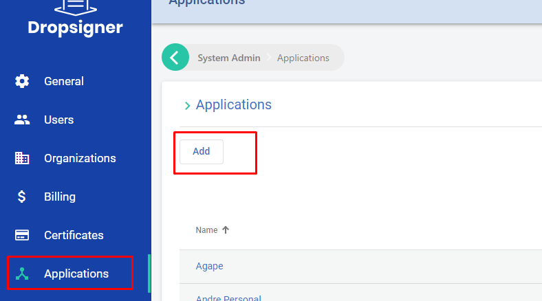
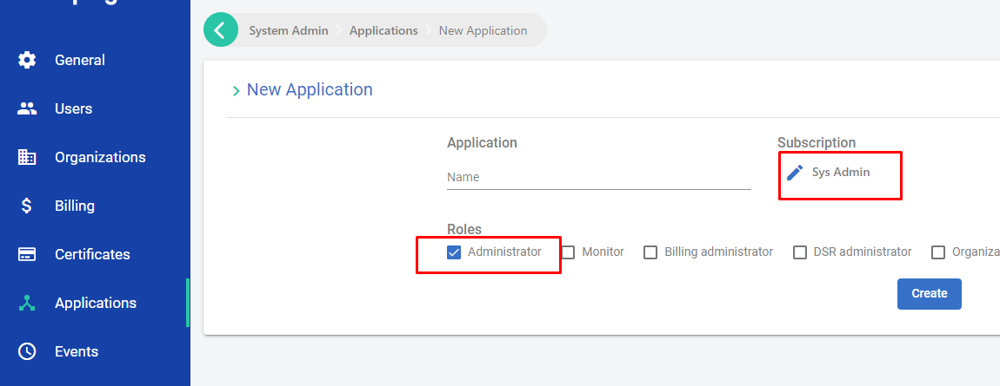
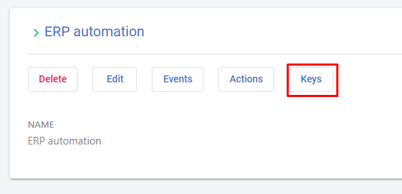
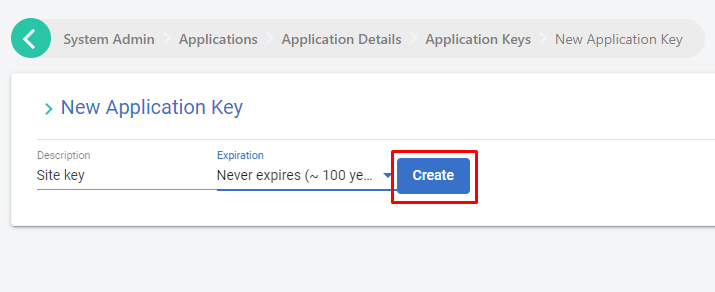

# Administration APIs

## Introduction
Administration APIs are used to create, manage and modify user and organizations in Signer.
To use the APIs, it is necessary to create a **API administration key**

## Generate an API administration key
In order to generate the key, add an application then select the organization `Sys Admin`:




Next, generate the key by clicking the button "Keys":






## Administration options
Select one of the use cases below

* [List users](#list-users)

* [Update user](#update-user)

* [List organizations](#list-organizations)

* [Create a new organization](#create-a-new-organization)

* [List users from organization](#list-users-from-organization)

* [Create or update users from an organization](#create-or-update-users-from-an-organization)

* [Remove user from organization](#remove-user-from-organization)

Those and other operations are specified in the [Postman](https://www.postman.com/) file [available here](https://cdn.lacunasoftware.com/signer/docs/Signer%20ADM-5.postman_collection.json).

### List users

In order to list users and see their data and permissions, use `GET /api/users`:

```json
GET /api/users?q=
{
    "items": [
        {
            "identifier": "99999999999",
            "phone": null,
            "id": "446e14b9-a661-446a-bb52-66b6c9f1ade9",
            "subject": "17bb43bd-1dac-46ce-95d2-62007bee2aea",
            "name": "User One",
            "emailAddress": "User.One@mailinator.com",
            "parentId": null,
            "rootRoles": [],
            "parentRootRoles": null,
            "subscriptions": [
                {
                    "agentId": "446e14b9-a661-446a-bb52-66b6c9f1ade9",
                    "subscriptionId": "28dd8bc0-ef7a-44e4-b2f8-08da757b7cf1",
                    "roles": [
                        "Admin",
                        "Manager",
                        "Basic"
                    ],
                    "parentRoles": null
                }
            ]
        },
        {
            "identifier": "11096802449",
            "phone": "+55 61 99999-9999",
            "id": "7b06a7ed-43fc-45df-96f8-cb29f4778e22",
            "subject": "ee72e66e-c150-47c3-a8fd-d4d0c6e12ef5",
            "name": "User Two",
            "emailAddress": "user.two@mailinator.com",
            "parentId": null,
            "rootRoles": [],
            "parentRootRoles": null,
            "subscriptions": [
                {
                    "agentId": "7b06a7ed-43fc-45df-96f8-cb29f4778e22",
                    "subscriptionId": "7289e60f-0c1f-4a3d-4b81-08da718c9ef3",
                    "roles": [
                        "Admin",
                        "Manager",
                        "Basic"
                    ],
                    "parentRoles": null
                }
            ]
        }
    ],
    "totalCount": 2,
    "nextCursor": null
}

```

* q (query - `string`) : filter by user name, identifier or e-mail (optional).

### Update user

To update user data, use `PUT /api/users/{subject}`:

```json
PUT /api/users/{subject}
{
  "name": "User Name",
  "identifier": "11096802449",
  "emailAddress": "user@mailinator.com",
  "phone": "+55 (61) 99999-9999"
}
```

* The `{subject}` parameter shows available information regarding user data as shown in [List users](#list-users).

### List organizations

To list organizations registered in the system, use `GET /api/admin/organizations`:

```json
GET /api/admin/organizations?limit=1&offset=1&personal=true&q=user

{
    "items": [
        {
            "id": "5aaa9032-1ad0-4c63-3c73-08d9d088eeac",
            "name": null,
            "identifier": null,
            "owner": {
                "id": "6f9d67cc-5cea-4672-b09e-ac04ed2e348f",
                "name": "Novo User"
            }
        }
    ],
    "totalCount": 17,
    "nextCursor": null
}
```

* limit (`int`) : limit items per page (optional).

* offset (`int`): page number (optional).

* q (query - `string`) : filter by organization name (optional).

### Create a new organization

To create an organization, use `POST /api/admin/organizations`:

```json
POST /api/admin/organizations

{
  "name": "newOrg",
  "identifier": "85932577000194"
}
```

### List users from organization

To list users from organization, use `GET /api/organizations/{id}/users`:

```json
GET /api/organizations/{id}/users?limit=1&offset=0&q=
{
    "items": [
        {
            "id": "7b06a7ed-43fc-45df-96f8-cb29f4778e22",
            "name": "User Name",
            "email": "user.name@mailinator.com",
            "identifier": "11096802449",
            "role": "",
            "parentId": null,
            "accessProfile": {
                "administrator": true,
                "manager": true,
                "parentRoles": null
            },
            "showNameWarning": false
        }
    ],
    "totalCount": 3,
    "nextCursor": null
}
```
* `{id}`: organization ID.

* limit (`int`): limit items per page (optional).

* offset (`int`): page number (optional).

* q (query - `string`): filter by user name (optional).

### Create or update users from an organization

To create or update users within an organization, use `POST /api/organizations/{id}/users`:

```json
POST /api/organizations/{id}/users
{
  "accessProfile": {
    "administrator": true,
    "manager": true
  },
  "name": "User Name",
  "identifier": "11096802449",
  "email": "user@mailinator.com"
}
```

* `{id}`: Organization ID.

### Remove user from organization

To remove an user from an organization, use `DELETE /api/admin/organizations/{id}/users/{userID}`:

* `{id}`: Organization ID.
* `{userID}`: user ID.

<!-- link to version in Portuguese -->
<div data-alt-locales="pt-br"></div>