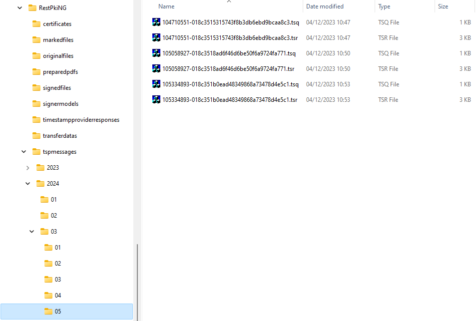

# Monitoramento do provimento de carimbos de tempo - Rest PKI Core

Para monitorar o provimento de carimbos de tempo na sua instância do [Rest PKI Core](../index.md), siga os passos abaixo:

1. Autentique-se na interface de gerenciamento da sua instância (ex: *https://restpkicore.suaempresa.com*)
1. Clique no seu nome no canto superior direito, em seguida em **Sys Admin**
1. No menu lateral, clique em **Timestamping**
1. Clique em um dos planos (*Tiers*) de carimbo de tempo
1. Na tela de detalhes do plano de carimbo de tempo, a seção **Solicitações** mostra as solicitações recebidas para o plano em questão, permitindo
   filtragem por data de início e/ou data de fim
1. Para ver mais informações sobre uma solicitação específica, clique no link *Mostrar detalhes* da solicitação em questão
1. Na dialog que se abrirá, é possível obter:
   * A solicitação (*Timestamp Query*) em formato binário conforme RFC 3161
   * A resposta (*Timestamp Reply*) em formato binário conforme RFC 3161
   * O carimbo de tempo emitido
   * O certificado da autoridade que emitiu o carimbo de tempo
   * Quais provedores foram utilizados para prover o carimbo de tempo e detalhes sobre a resposta de cada provedor, como tempo de resposta e código de retorno

Adicionalmente, é possível obter as mensagens do protocolo TSP -- solicitações (*timestamp queries*) e respostas (*timestamp replies*) -- diretamente no
armazenamento de blobs do sistema:



Para facilitar a consulta, as mensagens são agrupadas em pastas por ano, mês e dia, permitindo por exemplo obter com facilidade diretamente do storage todas as
mensagens de um determinado mês. Para cada solicitação há dois arquivos, conforme detalhado abaixo:

```
tspmessages/2024/03/05/104710551-018c3515315743f8b3db6ebd9bcaa8c3.tsq
            ─────┰──── ────┰────                                  ─┰─
                 │         │                                       └──── timestamp query (solicitação)
                 │         └──────────────────────────────────────────── horário (10:47:10.551)
                 └────────────────────────────────────────────────────── data (2024-03-05)

tspmessages/2024/03/05/104710551-018c3515315743f8b3db6ebd9bcaa8c3.tsr
            ─────┰──── ────┰────                                  ─┰─
                 │         │                                       └──── timestamp reply (resposta)
                 │         └──────────────────────────────────────────── horário (10:47:10.551)
                 └────────────────────────────────────────────────────── data (2024-03-05)
```

> [!NOTE]
> As datas e horas presentes nos nomes de arquivos de mensagens de protocolo TSP estão no fuso padrão do sistema (configuração `General:DefaultTimeZone`)

## Veja também

* [Guia de Operação](index.md)
