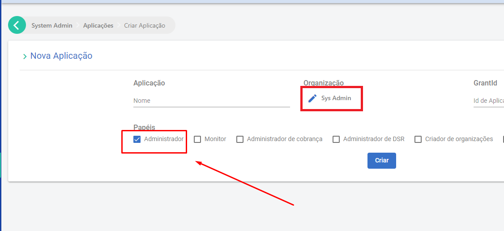

# APIs de Administração

## Introdução
As APIs de administração são utilizadas para criar, gerenciar e modificar usuários e organizações do Signer.

Para utilizar essas APIs é necessário criar uma chave de administração.

# Criação de chave de API de administração


Para gerá-la crie uma aplicação selecionado a organização Sys Admin:




Em seguida gere a chave na opção "Chaves":


## Opções de operações com a chave de administração

Escolha um dos casos de uso abaixo:

* [Atualizar dados de usuário](#atualizar-dados-de-usuário)

*  [Listar organizações](#listar-organizações)

* [Listar usuários da organização](#listar-usuários-da-organização)

* [Criar ou atualizar usuários de uma organização](#criar-ou-atualizar-usuários-de-uma-organização)

* [Remover usuário de uma organização](#remover-usuário-de-uma-organização)

Arquivo postman com as definiçôes das APIs: [Signer ADM APIs](../files/Signer_ADM-3.postman_collection.json)
## Atualizar dados de usuário

Liste os usuários passando o nome ou o CPF:
```json
GET /api/users?q=user
{
    "items": [
        {
            "identifier": "99999999999",
            "phone": null,
            "id": "446e14b9-a661-446a-bb52-66b6c9f1ade9",
            "subject": "17bb43bd-1dac-46ce-95d2-62007bee2aea",
            "name": "User One",
            "emailAddress": "User.One@mailinator.com",
            "parentId": null,
            "rootRoles": [],
            "parentRootRoles": null,
            "subscriptions": [
                {
                    "agentId": "446e14b9-a661-446a-bb52-66b6c9f1ade9",
                    "subscriptionId": "28dd8bc0-ef7a-44e4-b2f8-08da757b7cf1",
                    "roles": [
                        "Admin",
                        "Manager",
                        "Basic"
                    ],
                    "parentRoles": null
                }
            ]
        },
        {
            "identifier": "11096802449",
            "phone": "+55 61 99999-9999",
            "id": "7b06a7ed-43fc-45df-96f8-cb29f4778e22",
            "subject": "ee72e66e-c150-47c3-a8fd-d4d0c6e12ef5",
            "name": "User Two",
            "emailAddress": "user.two@mailinator.com",
            "parentId": null,
            "rootRoles": [],
            "parentRootRoles": null,
            "subscriptions": [
                {
                    "agentId": "7b06a7ed-43fc-45df-96f8-cb29f4778e22",
                    "subscriptionId": "7289e60f-0c1f-4a3d-4b81-08da718c9ef3",
                    "roles": [
                        "Admin",
                        "Manager",
                        "Basic"
                    ],
                    "parentRoles": null
                }
            ]
        }
    ],
    "totalCount": 2,
    "nextCursor": null
}

```
* q (query) : Filtra pelo nome do dono da organização (opcional).

Quando encontrado, copie o valor de "subject" do usuário que deve ser atualizado.


O valor deve ser usado na chamada para `/api/users/{subject}`, como mostrado abaixo:

```json
PUT /api/users/{subject}
{
  "name": "User Name",
  "identifier": "11096802449",
  "emailAddress": "user@mailinator.com",
  "phone": "+55 (61) 99999-9999"
}

```

## Listar organizações

Filtre as organizações pelos parâmetros desejados:

```json

GET /api/admin/organizations?limit=1&offset=1&personal=true&q=user

```
* limit : Quantidade de itens por página.

* offset: Número da página.

* q (query) : Filtra pelo nome do dono da organização (opcional).

```json
{
    "items": [
        {
            "id": "5aaa9032-1ad0-4c63-3c73-08d9d088eeac",
            "name": null,
            "identifier": null,
            "owner": {
                "id": "6f9d67cc-5cea-4672-b09e-ac04ed2e348f",
                "name": "Novo User"
            }
        }
    ],
    "totalCount": 17,
    "nextCursor": null
}
```

## Criar uma nova organização
Crie uma organização passando as informações da nova organização:
```json
POST /api/admin/organizations

{
  "name": "newOrg",
  "identifier": "85932577000194"
}
```

## Listar usuários da organização

 Passe o ID da organização `/api/organizations/{id}`:


```json
GET /api/organizations/{id}/users?limit=1&offset=0&q={username}
```
* limit : Quantidade de itens por página.

* offset: Número da página.

* q (query) : Filtra pelo nome do usuário (opcional).

```json
{
    "items": [
        {
            "id": "7b06a7ed-43fc-45df-96f8-cb29f4778e22",
            "name": "User Name",
            "email": "user.name@mailinator.com",
            "identifier": "11096802449",
            "role": "",
            "parentId": null,
            "accessProfile": {
                "administrator": true,
                "manager": true,
                "parentRoles": null
            },
            "showNameWarning": false
        }
    ],
    "totalCount": 3,
    "nextCursor": null
}
```

## Criar ou atualizar usuários de uma organização

Para criar ou atualizar usuários basta utilizar `/api/organizations/{id}/users` passando o Id da organização:

```json

POST /api/organizations/{id}/users
{
  "accessProfile": {
    "administrator": true,
    "manager": true
  },
  "name": "User Name",
  "identifier": "11096802449",
  "email": "user@mailinator.com"
}
```

## Remover usuário de uma organização

Para deletar um usuário da organização basta passar o Id da organização e o id de usuário a ser removido pelo URL:
```json
DELETE /api/admin/organizations/{id}/users/{userID}
```

