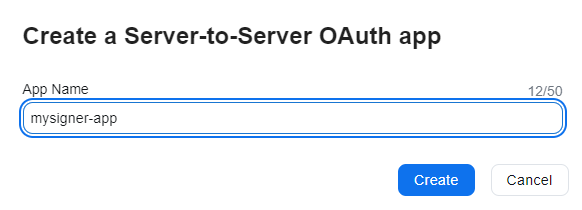

# Integração com Zoom no Signer

O Signer permite integração com [Zoom](https://zoom.us/) para realizar e armazenar videoconferências relacionadas a documentos.

<a name="account-config" />
## Configuração da conta

Para esta integração é preciso de uma conta do Zoom com plano igual ou superior ao Profissional.

Além disso, as configurações da conta devem permitir o recurso `Gravação em nuvem` conforme as imagens abaixo:

Nesta integração, cada usuário/licença da conta é considerado como uma sala de reunião. Quando um usuário do Signer solicita a criação
de uma conferência, o Signer lista todos os usuários do Zoom e tenta encontrar um que não esteja em uma conferência no momento. Por
isso, caso deseje realizar conferências simultâneas, é importante ter mais de um usuário/licença na conta do Zoom.

> [!TIP]
> Ao configurar os usuários da conta, não esqueça de atribuir-lhes a licença, caso contrário conferências realizadas
> com aquele usuário terão o vídeo salvo na nuvem.

<a name="credentials" />
## Obtenção de credenciais

Para habilitar a integração no assinador é preciso obter uma credencial JWT que permite que o Assinador chame as APIs do Zoom.
Para isso siga o procedimento abaixo:

1. Após fazer o login na sua conta, acesse [https://marketplace.zoom.us/](https://marketplace.zoom.us/);
1. Abra o menu `Develop` no canto superior direito da tela;
1. Selecione a opção `Build App` dentro do seletor que se abriu;
1. Selecione a opção `Server-to-Server OAuth`:

1. Dê um nome para seu aplicativo (pode ser o mesmo nome de sua instância do Assinador);

1. Selecione o painel `Information`;
1. Preencha as informações básicas e as de contato do desenvolvedor;
1. Selecione o painel `Scopes`;
1. Selecione os seguintes:
    - Meeting:
        - View all user meetings (meeting:read:admin)
        - View and manage all user meetings (meeting:write:admin)
    - Recording:
        - View all user recordings (recording:read:admin)
        - View and manage all user recordings (recording:write:admin)
    - User:
        - View all user information (user:read:admin)
        - View users information and manage users (user:write:admin)
    - Room:
        - View all user's Zoom Rooms information (room:read:admin)
        - View and manage all user's Zoom Rooms information (room:write:admin)
1. Selecione o painel `App Credentials`;
1. Copie as informações necessárias para a integração: `AccountId`, `ClientId`, e `ClientSecret`.

<a name="operation" />
## Funcionamento

Para criar uma conferência, acesse a tela de detalhes de um documento e clique no botão iniciar conferência:

> [!NOTE]
> Somente o criador do documento (para conta pessoal) ou alguém com permissão de gerente ou administrador (para conta de organização)
> pode realizar essa ação.

Em seguida, serão exibidos dois links: o primeiro para acessar como o anfitrião (host) da conferência e outro para enviar/compartilhar 
com os participantes:

No Zoom, ao final da conferência o anfitrião (host) deve utilizar a opção `End Meeting for All`:

Uma vez encerrada a reunião, o vídeo da reunião aparecerá na tela de detalhes do documento: 

> [!NOTE]
> O tempo para ser disponibilizado o vídeo varia em função do tamanho da reunião. Para reuniões pequenas demora cerca de 15 a 20 minutos. 
> Para reuniões grandes pode demorar até 24 horas.
